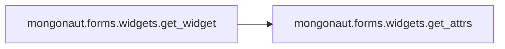

# Mongonaut Forms

[_Documentation generated by Documatic_](https://www.documatic.com)

<!---Documatic-section-Codebase Structure-start--->
## Codebase Structure

<!---Documatic-block-system_architecture-start--->
```mermaid
None
```
<!---Documatic-block-system_architecture-end--->

# #
<!---Documatic-section-Codebase Structure-end--->

<!---Documatic-section-mongonaut.forms.form_mixins.get_document_unicode-start--->
## [mongonaut.forms.form_mixins.get_document_unicode](5-mongonaut_forms.md#mongonaut.forms.form_mixins.get_document_unicode)

<!---Documatic-section-get_document_unicode-start--->
<!---Documatic-block-mongonaut.forms.form_mixins.get_document_unicode-start--->
<details>
	<summary><code>mongonaut.forms.form_mixins.get_document_unicode</code> code snippet</summary>

```python
def get_document_unicode(document):
    try:
        return document.__unicode__()
    except AttributeError:
        return six.text_type(document)
```
</details>
<!---Documatic-block-mongonaut.forms.form_mixins.get_document_unicode-end--->
<!---Documatic-section-get_document_unicode-end--->

# #
<!---Documatic-section-mongonaut.forms.form_mixins.get_document_unicode-end--->

<!---Documatic-section-mongonaut.forms.form_utils.has_digit-start--->
## [mongonaut.forms.form_utils.has_digit](5-mongonaut_forms.md#mongonaut.forms.form_utils.has_digit)

<!---Documatic-section-has_digit-start--->
<!---Documatic-block-mongonaut.forms.form_utils.has_digit-start--->
<details>
	<summary><code>mongonaut.forms.form_utils.has_digit</code> code snippet</summary>

```python
def has_digit(string_or_list, sep='_'):
    if isinstance(string_or_list, (tuple, list)):
        list_length = len(string_or_list)
        if list_length:
            return six.text_type(string_or_list[-1]).isdigit()
        else:
            return False
    else:
        return has_digit(string_or_list.split(sep))
```
</details>
<!---Documatic-block-mongonaut.forms.form_utils.has_digit-end--->
<!---Documatic-section-has_digit-end--->

# #
<!---Documatic-section-mongonaut.forms.form_utils.has_digit-end--->

<!---Documatic-section-mongonaut.forms.form_utils.make_key-start--->
## [mongonaut.forms.form_utils.make_key](5-mongonaut_forms.md#mongonaut.forms.form_utils.make_key)

<!---Documatic-section-make_key-start--->
<!---Documatic-block-mongonaut.forms.form_utils.make_key-start--->
<details>
	<summary><code>mongonaut.forms.form_utils.make_key</code> code snippet</summary>

```python
def make_key(*args, **kwargs):
    sep = kwargs.get('sep', u'_')
    exclude_last_string = kwargs.get('exclude_last_string', False)
    string_array = []
    for arg in args:
        if isinstance(arg, list):
            string_array.append(six.text_type(sep.join(arg)))
        elif exclude_last_string:
            new_key_array = arg.split(sep)[:-1]
            if len(new_key_array) > 0:
                string_array.append(make_key(new_key_array))
        else:
            string_array.append(six.text_type(arg))
    return sep.join(string_array)
```
</details>
<!---Documatic-block-mongonaut.forms.form_utils.make_key-end--->
<!---Documatic-section-make_key-end--->

# #
<!---Documatic-section-mongonaut.forms.form_utils.make_key-end--->

<!---Documatic-section-mongonaut.forms.widgets.get_widget-start--->
## [mongonaut.forms.widgets.get_widget](5-mongonaut_forms.md#mongonaut.forms.widgets.get_widget)

<!---Documatic-section-get_widget-start--->


### Object Calls

* [mongonaut.forms.widgets.get_attrs](5-mongonaut_forms.md#mongonaut.forms.widgets.get_attrs)

<!---Documatic-block-mongonaut.forms.widgets.get_widget-start--->
<details>
	<summary><code>mongonaut.forms.widgets.get_widget</code> code snippet</summary>

```python
def get_widget(model_field, disabled=False):
    attrs = get_attrs(model_field, disabled)
    if hasattr(model_field, 'max_length') and (not model_field.max_length):
        return forms.Textarea(attrs=attrs)
    elif isinstance(model_field, DateTimeField):
        return forms.DateTimeInput(attrs=attrs)
    elif isinstance(model_field, BooleanField):
        return forms.CheckboxInput(attrs=attrs)
    elif isinstance(model_field, ReferenceField) or model_field.choices:
        return forms.Select(attrs=attrs)
    elif isinstance(model_field, ListField) or isinstance(model_field, EmbeddedDocumentField) or isinstance(model_field, GeoPointField):
        return None
    else:
        return forms.TextInput(attrs=attrs)
```
</details>
<!---Documatic-block-mongonaut.forms.widgets.get_widget-end--->
<!---Documatic-section-get_widget-end--->

# #
<!---Documatic-section-mongonaut.forms.widgets.get_widget-end--->

<!---Documatic-section-mongonaut.forms.widgets.get_attrs-start--->
## [mongonaut.forms.widgets.get_attrs](5-mongonaut_forms.md#mongonaut.forms.widgets.get_attrs)

<!---Documatic-section-get_attrs-start--->
<!---Documatic-block-mongonaut.forms.widgets.get_attrs-start--->
<details>
	<summary><code>mongonaut.forms.widgets.get_attrs</code> code snippet</summary>

```python
def get_attrs(model_field, disabled=False):
    attrs = {}
    attrs['class'] = 'span6 xlarge'
    if disabled or isinstance(model_field, ObjectIdField):
        attrs['class'] += ' disabled'
        attrs['readonly'] = 'readonly'
    return attrs
```
</details>
<!---Documatic-block-mongonaut.forms.widgets.get_attrs-end--->
<!---Documatic-section-get_attrs-end--->

# #
<!---Documatic-section-mongonaut.forms.widgets.get_attrs-end--->

<!---Documatic-section-mongonaut.forms.widgets.get_form_field_class-start--->
## [mongonaut.forms.widgets.get_form_field_class](5-mongonaut_forms.md#mongonaut.forms.widgets.get_form_field_class)

<!---Documatic-section-get_form_field_class-start--->
<!---Documatic-block-mongonaut.forms.widgets.get_form_field_class-start--->
<details>
	<summary><code>mongonaut.forms.widgets.get_form_field_class</code> code snippet</summary>

```python
def get_form_field_class(model_field):
    FIELD_MAPPING = {IntField: forms.IntegerField, StringField: forms.CharField, FloatField: forms.FloatField, BooleanField: forms.BooleanField, DateTimeField: forms.DateTimeField, DecimalField: forms.DecimalField, URLField: forms.URLField, EmailField: forms.EmailField}
    return FIELD_MAPPING.get(model_field.__class__, forms.CharField)
```
</details>
<!---Documatic-block-mongonaut.forms.widgets.get_form_field_class-end--->
<!---Documatic-section-get_form_field_class-end--->

# #
<!---Documatic-section-mongonaut.forms.widgets.get_form_field_class-end--->

[_Documentation generated by Documatic_](https://www.documatic.com)