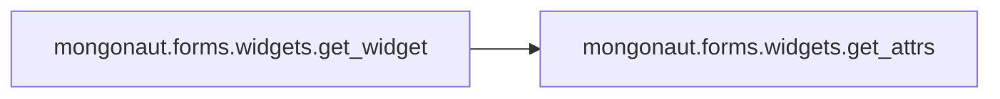

# Key Objects

[_Documentation generated by Documatic_](https://www.documatic.com)

<!---Documatic-section-mongonaut.forms.widgets.get_widget-start--->
## mongonaut.forms.widgets.get_widget

<!---Documatic-section-get_widget-start--->


### Object Calls

* mongonaut.forms.widgets.get_attrs

<!---Documatic-block-mongonaut.forms.widgets.get_widget-start--->
<details>
	<summary><code>mongonaut.forms.widgets.get_widget</code> code snippet</summary>

```python
def get_widget(model_field, disabled=False):
    attrs = get_attrs(model_field, disabled)
    if hasattr(model_field, 'max_length') and (not model_field.max_length):
        return forms.Textarea(attrs=attrs)
    elif isinstance(model_field, DateTimeField):
        return forms.DateTimeInput(attrs=attrs)
    elif isinstance(model_field, BooleanField):
        return forms.CheckboxInput(attrs=attrs)
    elif isinstance(model_field, ReferenceField) or model_field.choices:
        return forms.Select(attrs=attrs)
    elif isinstance(model_field, ListField) or isinstance(model_field, EmbeddedDocumentField) or isinstance(model_field, GeoPointField):
        return None
    else:
        return forms.TextInput(attrs=attrs)
```
</details>
<!---Documatic-block-mongonaut.forms.widgets.get_widget-end--->
<!---Documatic-section-get_widget-end--->

# #
<!---Documatic-section-mongonaut.forms.widgets.get_widget-end--->

<!---Documatic-section-mongonaut.forms.widgets.get_attrs-start--->
## mongonaut.forms.widgets.get_attrs

<!---Documatic-section-get_attrs-start--->
<!---Documatic-block-mongonaut.forms.widgets.get_attrs-start--->
<details>
	<summary><code>mongonaut.forms.widgets.get_attrs</code> code snippet</summary>

```python
def get_attrs(model_field, disabled=False):
    attrs = {}
    attrs['class'] = 'span6 xlarge'
    if disabled or isinstance(model_field, ObjectIdField):
        attrs['class'] += ' disabled'
        attrs['readonly'] = 'readonly'
    return attrs
```
</details>
<!---Documatic-block-mongonaut.forms.widgets.get_attrs-end--->
<!---Documatic-section-get_attrs-end--->

# #
<!---Documatic-section-mongonaut.forms.widgets.get_attrs-end--->

<!---Documatic-section-mongonaut.forms.form_utils.make_key-start--->
## mongonaut.forms.form_utils.make_key

<!---Documatic-section-make_key-start--->
<!---Documatic-block-mongonaut.forms.form_utils.make_key-start--->
<details>
	<summary><code>mongonaut.forms.form_utils.make_key</code> code snippet</summary>

```python
def make_key(*args, **kwargs):
    sep = kwargs.get('sep', u'_')
    exclude_last_string = kwargs.get('exclude_last_string', False)
    string_array = []
    for arg in args:
        if isinstance(arg, list):
            string_array.append(six.text_type(sep.join(arg)))
        elif exclude_last_string:
            new_key_array = arg.split(sep)[:-1]
            if len(new_key_array) > 0:
                string_array.append(make_key(new_key_array))
        else:
            string_array.append(six.text_type(arg))
    return sep.join(string_array)
```
</details>
<!---Documatic-block-mongonaut.forms.form_utils.make_key-end--->
<!---Documatic-section-make_key-end--->

# #
<!---Documatic-section-mongonaut.forms.form_utils.make_key-end--->

<!---Documatic-section-mongonaut.forms.form_utils.has_digit-start--->
## mongonaut.forms.form_utils.has_digit

<!---Documatic-section-has_digit-start--->
<!---Documatic-block-mongonaut.forms.form_utils.has_digit-start--->
<details>
	<summary><code>mongonaut.forms.form_utils.has_digit</code> code snippet</summary>

```python
def has_digit(string_or_list, sep='_'):
    if isinstance(string_or_list, (tuple, list)):
        list_length = len(string_or_list)
        if list_length:
            return six.text_type(string_or_list[-1]).isdigit()
        else:
            return False
    else:
        return has_digit(string_or_list.split(sep))
```
</details>
<!---Documatic-block-mongonaut.forms.form_utils.has_digit-end--->
<!---Documatic-section-has_digit-end--->

# #
<!---Documatic-section-mongonaut.forms.form_utils.has_digit-end--->

<!---Documatic-section-mongonaut.forms.form_mixins.get_document_unicode-start--->
## mongonaut.forms.form_mixins.get_document_unicode

<!---Documatic-section-get_document_unicode-start--->
<!---Documatic-block-mongonaut.forms.form_mixins.get_document_unicode-start--->
<details>
	<summary><code>mongonaut.forms.form_mixins.get_document_unicode</code> code snippet</summary>

```python
def get_document_unicode(document):
    try:
        return document.__unicode__()
    except AttributeError:
        return six.text_type(document)
```
</details>
<!---Documatic-block-mongonaut.forms.form_mixins.get_document_unicode-end--->
<!---Documatic-section-get_document_unicode-end--->

# #
<!---Documatic-section-mongonaut.forms.form_mixins.get_document_unicode-end--->

<!---Documatic-section-mongonaut.utils.is_valid_object_id-start--->
## mongonaut.utils.is_valid_object_id

<!---Documatic-section-is_valid_object_id-start--->
<!---Documatic-block-mongonaut.utils.is_valid_object_id-start--->
<details>
	<summary><code>mongonaut.utils.is_valid_object_id</code> code snippet</summary>

```python
def is_valid_object_id(value):
    try:
        OBJECT_ID.validate(value)
        return True
    except ValidationError:
        return False
```
</details>
<!---Documatic-block-mongonaut.utils.is_valid_object_id-end--->
<!---Documatic-section-is_valid_object_id-end--->

# #
<!---Documatic-section-mongonaut.utils.is_valid_object_id-end--->

<!---Documatic-section-mongonaut.utils.translate_value-start--->
## mongonaut.utils.translate_value

<!---Documatic-section-translate_value-start--->
<!---Documatic-block-mongonaut.utils.translate_value-start--->
<details>
	<summary><code>mongonaut.utils.translate_value</code> code snippet</summary>

```python
def translate_value(document_field, form_value):
    value = form_value
    if isinstance(document_field, ReferenceField):
        value = document_field.document_type.objects.get(id=form_value) if form_value else None
    return value
```
</details>
<!---Documatic-block-mongonaut.utils.translate_value-end--->
<!---Documatic-section-translate_value-end--->

# #
<!---Documatic-section-mongonaut.utils.translate_value-end--->

<!---Documatic-section-mongonaut.__init__.get_version-start--->
## mongonaut.__init__.get_version

<!---Documatic-section-get_version-start--->
<!---Documatic-block-mongonaut.__init__.get_version-start--->
<details>
	<summary><code>mongonaut.__init__.get_version</code> code snippet</summary>

```python
def get_version():
    version = '%s.%s' % (VERSION[0], VERSION[1])
    if VERSION[2]:
        version = '%s.%s' % (version, VERSION[2])
    return version
```
</details>
<!---Documatic-block-mongonaut.__init__.get_version-end--->
<!---Documatic-section-get_version-end--->

# #
<!---Documatic-section-mongonaut.__init__.get_version-end--->

<!---Documatic-section-mongonaut.forms.widgets.get_form_field_class-start--->
## mongonaut.forms.widgets.get_form_field_class

<!---Documatic-section-get_form_field_class-start--->
<!---Documatic-block-mongonaut.forms.widgets.get_form_field_class-start--->
<details>
	<summary><code>mongonaut.forms.widgets.get_form_field_class</code> code snippet</summary>

```python
def get_form_field_class(model_field):
    FIELD_MAPPING = {IntField: forms.IntegerField, StringField: forms.CharField, FloatField: forms.FloatField, BooleanField: forms.BooleanField, DateTimeField: forms.DateTimeField, DecimalField: forms.DecimalField, URLField: forms.URLField, EmailField: forms.EmailField}
    return FIELD_MAPPING.get(model_field.__class__, forms.CharField)
```
</details>
<!---Documatic-block-mongonaut.forms.widgets.get_form_field_class-end--->
<!---Documatic-section-get_form_field_class-end--->

# #
<!---Documatic-section-mongonaut.forms.widgets.get_form_field_class-end--->

<!---Documatic-section-mongonaut.utils.trim_field_key-start--->
## mongonaut.utils.trim_field_key

<!---Documatic-section-trim_field_key-start--->
<!---Documatic-block-mongonaut.utils.trim_field_key-start--->
<details>
	<summary><code>mongonaut.utils.trim_field_key</code> code snippet</summary>

```python
def trim_field_key(document, field_key):
    trimming = True
    left_over_key_values = []
    current_key = field_key
    while trimming and current_key:
        if hasattr(document, current_key):
            trimming = False
        else:
            key_array = current_key.split('_')
            left_over_key_values.append(key_array.pop())
            current_key = u'_'.join(key_array)
    left_over_key_values.reverse()
    return (current_key, left_over_key_values)
```
</details>
<!---Documatic-block-mongonaut.utils.trim_field_key-end--->
<!---Documatic-section-trim_field_key-end--->

# #
<!---Documatic-section-mongonaut.utils.trim_field_key-end--->

<!---Documatic-section-mongonaut.templatetags.mongonaut_tags.get_document_value-start--->
## mongonaut.templatetags.mongonaut_tags.get_document_value

<!---Documatic-section-get_document_value-start--->
<!---Documatic-block-mongonaut.templatetags.mongonaut_tags.get_document_value-start--->
<details>
	<summary><code>mongonaut.templatetags.mongonaut_tags.get_document_value</code> code snippet</summary>

```python
@register.simple_tag()
def get_document_value(document, key):
    value = getattr(document, key)
    if isinstance(value, ObjectId):
        return value
    if isinstance(document._fields.get(key), URLField):
        return mark_safe('<a href="{0}">{1}</a>'.format(value, value))
    if isinstance(value, Document):
        app_label = value.__module__.replace('.models', '')
        document_name = value._class_name
        url = reverse('document_detail', kwargs={'app_label': app_label, 'document_name': document_name, 'id': value.id})
        return mark_safe('<a href="{0}">{1}</a>'.format(url, value))
    return value
```
</details>
<!---Documatic-block-mongonaut.templatetags.mongonaut_tags.get_document_value-end--->
<!---Documatic-section-get_document_value-end--->

# #
<!---Documatic-section-mongonaut.templatetags.mongonaut_tags.get_document_value-end--->

[_Documentation generated by Documatic_](https://www.documatic.com)